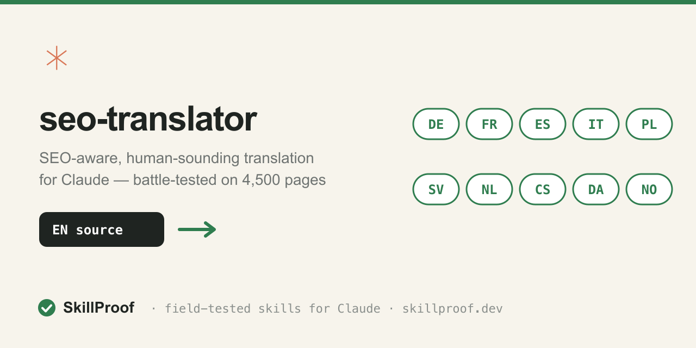
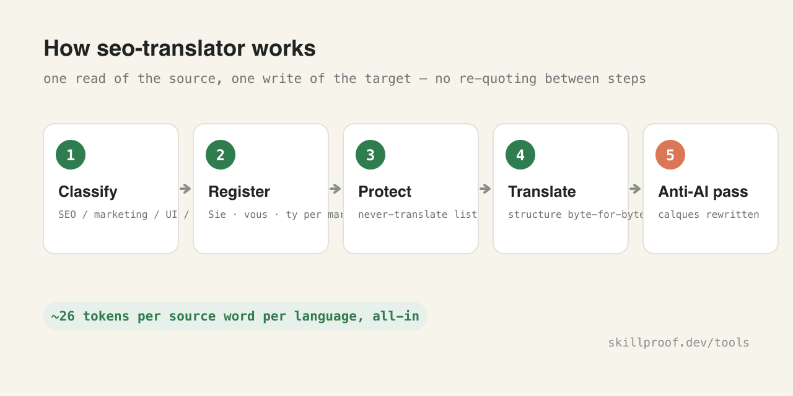
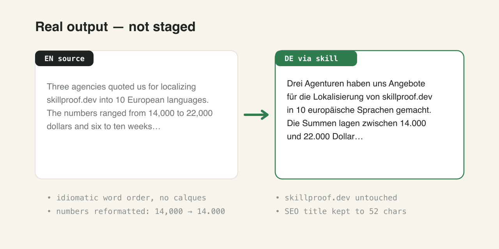
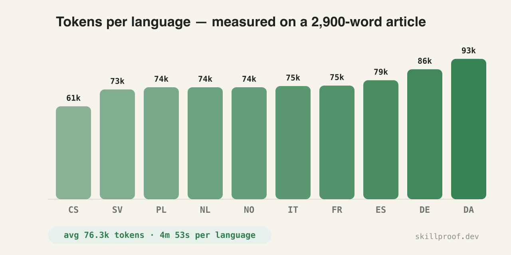

# skillproof-skills

Skills built and battle-tested by [SkillProof](https://skillproof.dev) — the tested Claude skills directory. We install and bench-test other people's skills for a living; the skills in this repo went through the same public protocol: clean install, trigger battery, output vs. baseline, docs honesty.



## seo-translator

**SEO-aware, human-sounding translation for Claude and Claude Code.** Distills the methodology we used to localize [skillproof.dev](https://skillproof.dev) — 4,500+ pages — into 10 European languages: per-market register, SEO field limits, a never-translate list, and an anti-AI-pattern pass, all in one SKILL.md.



### What it does differently

Generic "translate this" prompts produce word-for-word output that reads like a machine wrote it and ignores how search works in the target market. This skill makes Claude:

1. **Classify before translating.** SEO fields (title ≤65 chars, meta description ≤155), marketing copy, UI strings, and technical docs each get different treatment — a truncated German meta description is a lost click, not a style problem.
2. **Match the market's register.** German dev-tool copy wants Sie, Polish wants ty, French wants vous. The skill carries a per-language register table so you don't relitigate this every session.
3. **Keep a never-translate list.** Product names, code spans, CLI commands, URLs, class names inside HTML — translated identifiers are the #1 way localization breaks a live site.
4. **Preserve structure byte-for-byte.** Markdown hierarchy, tables, raw HTML blocks survive; only human-visible text changes.
5. **Run an anti-AI pass.** Calques, uniform sentence length, and stock translated-sounding constructions get rewritten before the output ships.
6. **Stay token-disciplined.** One read of the source, one write of the target — no re-quoting the full document between steps.

### Install

```bash
git clone https://github.com/Skillproofdev/skillproof-skills
cp -r skillproof-skills/skills/seo-translator ~/.claude/skills/
# restart Claude Code — the skill triggers on translation/localization requests
```

### Example (real output, not staged)



Source — the opening of [our case-study article](https://skillproof.dev/blog/claude-seo-translation):

> Three agencies quoted us for localizing skillproof.dev into 10 European languages. The numbers ranged from 14,000 to 22,000 dollars and six to ten weeks…

German, via this skill:

> Drei Agenturen haben uns Angebote für die Lokalisierung von skillproof.dev in 10 europäische Sprachen gemacht. Die Summen lagen zwischen 14.000 und 22.000 Dollar, bei sechs bis zehn Wochen Laufzeit…

Note what happened: idiomatic sentence order («haben uns Angebote … gemacht», not a calque of "quoted us"), `skillproof.dev` untouched, numbers reformatted to German convention (14.000), em-dash rhythm adapted. The SEO title came out at 52 chars: *«Claude als SEO-Übersetzer: 4.500 Seiten, 10 Sprachen»*.

French title, same run: *«Claude traducteur SEO : 4 500 pages en 10 langues»* — French non-breaking-space punctuation and digit grouping, 49 chars.

### Token consumption (measured, not estimated)

We benchmarked the skill on a real task: translating a 2,900-word article (markdown + tables + embedded HTML CTA blocks) into 10 languages, one Claude Sonnet agent per language, each agent reading SKILL.md first and following it.



Raw telemetry:

| Language | Tokens | Wall time | Output words |
|---|---:|---:|---:|
| Czech | 61,364 | 3m 01s | 2,197 |
| Swedish | 72,514 | 4m 42s | 2,301 |
| Polish | 73,942 | 4m 42s | 2,205 |
| Dutch | 73,944 | 4m 38s | 2,344 |
| Norwegian | 73,945 | 5m 12s | 2,346 |
| Italian | 74,739 | 4m 10s | 2,627 |
| French | 75,058 | 4m 25s | 2,887 |
| Spanish | 78,585 | 4m 45s | 2,733 |
| German | 85,835 | 5m 50s | 2,298 |
| Danish | 92,703 | 7m 24s | 2,333 |
| **Average** | **76,263** | **4m 53s** | **2,427** |

Rule of thumb: **~26 tokens per source word per language**, all-in (reading the skill, reading the source, translating, validating). The 10-language run cost 762k tokens total and finished in under 8 minutes wall-clock because the agents ran in parallel. The agency quotes for the same site started at $14,000 and six weeks.

### When it triggers

The skill description activates on: translate/localize requests, multilingual SEO work, hreflang content preparation, register/tone questions for non-English markets. It stays out of the way for code translation ("translate this Python to Go") — that's explicitly excluded.

### Full story

How we localized the whole site — the six rules with failure examples, what broke (agents "waiting for notifications", copyright refusals on our own content), and honest cost accounting:
**[Claude as an SEO Translator: 4,500 Pages, 10 Languages →](https://skillproof.dev/blog/claude-seo-translation)**

## Why trust these

We test other people's skills for a living ([public methodology](https://skillproof.dev/methodology)). Our own skills get the same treatment — the test report for each lives on its SkillProof catalog page, verdict and all.

Free tools for skill authors: [SKILL.md validator, token calculator, Rules⇄SKILL.md converter](https://skillproof.dev/tools).

## License

MIT — use it, fork it, ship it.
